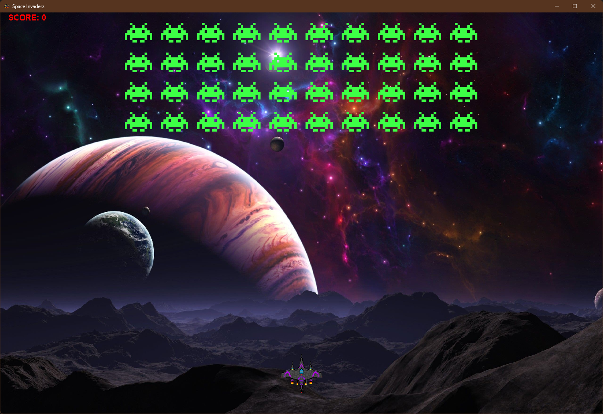
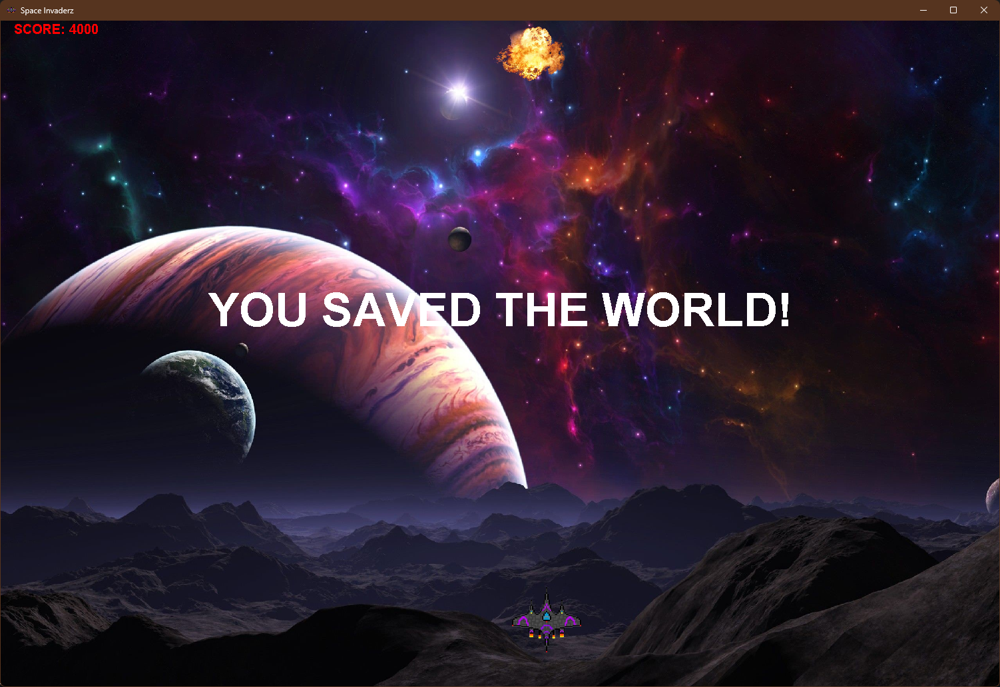
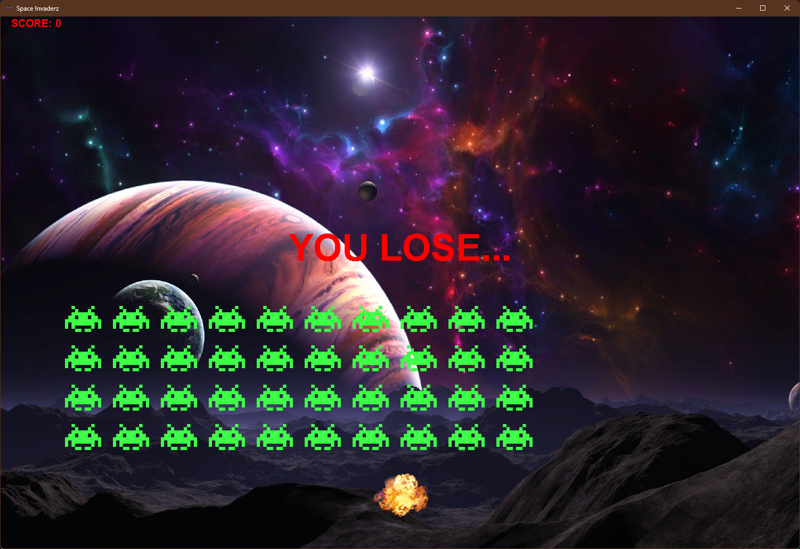

# Space Invaderz

## Description

Space Invaderz is a classic arcade-style game implemented in Java using the 2D graphics library. The objective of the game is to control a spaceship and eliminate all the invading aliens. Players can maneuver the spaceship using the left and right arrow keys and shoot projectiles by pressing the spacebar. Be cautious, if an alien collides with your spaceship, it's game over!

## How to Play

1. **Controls:**

   - Use the left and right arrow keys to move the spaceship horizontally.
   - Press the spacebar to shoot projectiles at the invading aliens.

2. **Objective:**

   - Your goal is to eliminate all the aliens before they reach your spaceship or overrun the bottom of the screen.
   - Shoot accurately and swiftly to prevent the aliens from advancing too close.

3. **Winning and Losing:**
   - If you successfully destroy all the aliens, you win the game.
     
   - If any alien makes contact with your spaceship, you lose the game.
     

## License

This project is licensed under the [MIT License](LICENSE).
